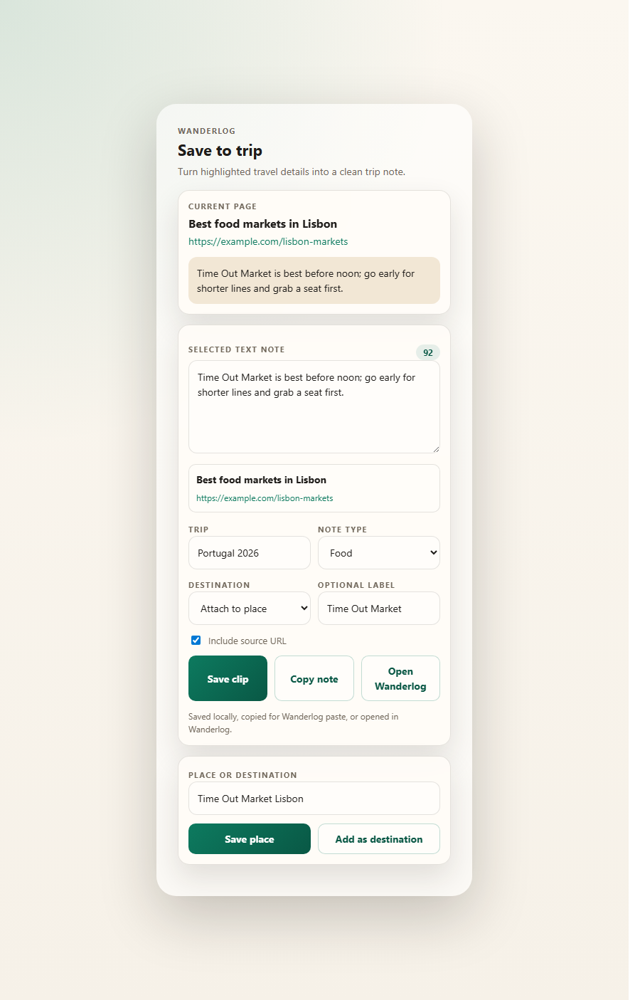
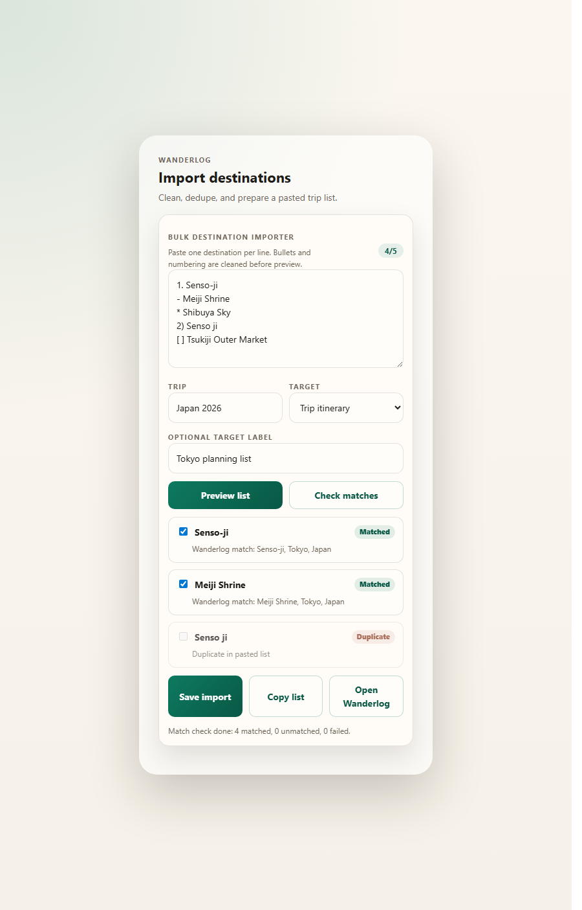

<p align="center">
  
</p>

# Wanderlog Notes Clipper

[](https://github.com/rosemontni/extension/actions/workflows/ci.yml)
[](CHANGELOG.md)
[](LICENSE)
[](manifest.json)

Wanderlog Notes Clipper is a Manifest V3 Chrome extension that saves places, selected travel notes, and bulk destination lists **directly into your Wanderlog trips** — no copy-pasting required.

The promotional banner in `assets/wanderlog-notes-banner.png` was generated with GPT Image 2.





## At a Glance

- Save places from any webpage into Wanderlog's authenticated save panel.
- Turn highlighted travel advice into editable trip notes with source attribution.
- Paste destination lists, clean duplicates, preview matches, and send them to a selected trip.
- Reuse your existing Wanderlog browser session; the extension never asks for or stores your password.
- Keep Copy fallbacks available when Wanderlog's private web API changes.

## Features

- **Direct trip write** — select a trip from a pre-populated dropdown and send notes or places straight into Wanderlog without leaving the page.
- **Save a place** by opening Wanderlog's authenticated save/search panel for the active tab.
- **Add a destination** by resolving highlighted text through Wanderlog geo autocomplete, then opening Wanderlog's trip creation flow with the destination pre-selected.
- **Clip selected text** — right-click any highlighted travel text, review and edit the note, choose a note type and target, then send it directly to a trip or copy it for a manual paste.
- **Bulk destination importer** — paste a list of places (one per line), preview the cleaned entries, optionally check Wanderlog geo matches, then send them all to a trip in one click.
- **Recent activity log** — quick local recall of sent notes, imports, and place searches.

## Install Locally

1. Download and unzip the latest release asset from [GitHub Releases](https://github.com/rosemontni/extension/releases/latest).
2. Open `chrome://extensions`.
3. Turn on **Developer mode**.
4. Click **Load unpacked**.
5. Select the unzipped extension folder.

## Prerequisites for Direct Write

Most extension features work immediately after install. **Sending notes or places directly into a Wanderlog trip** requires one extra step: open [app.wanderlog.com](https://app.wanderlog.com) and navigate to any trip before using the Send to Wanderlog button.

| Feature | Requires visiting app.wanderlog.com |
|---|---|
| Save a place (panel / map) | No |
| Add as destination | No |
| Clip text → Copy note | No |
| Bulk import → Copy list | No |
| **Clip text → Send to Wanderlog** | **Yes — once per session** |
| **Bulk import → Send to Wanderlog** | **Yes — once per session** |

Once you have visited a Wanderlog trip page, the extension caches your trip list. It stays fresh for 10 minutes and is repopulated automatically each time you browse Wanderlog. Use the **Reload** button in the popup if the list looks stale.

## Sending Notes Directly to a Trip

After visiting app.wanderlog.com, the popup pre-populates the trip selector automatically. Pick a trip and send.

**For a selected-text note:**

1. Highlight travel advice or a useful detail on any webpage.
2. Right-click and choose **Save selected text to Wanderlog**.
3. Review and edit the note in the popup.
4. Choose a note type and optional target label.
5. The trip selector is already populated — pick a trip and click **Send to Wanderlog**.
6. Use **Copy note** if you prefer to paste it into Wanderlog manually.

**For a bulk destination list:**

1. Paste one destination per line into **Bulk destination importer**.
2. Click **Preview list** to strip bullets, numbering, and duplicates.
3. Optionally click **Check matches** to verify Wanderlog geo coverage before sending.
4. Pick a trip from the pre-populated dropdown.
5. Click **Send to Wanderlog** — all previewed places are added to that trip's places directly.
6. Use **Copy list** if you prefer to paste the destinations into Wanderlog manually.

## Privacy and Direct Write

Wanderlog does not publish a write API. This extension discovers Wanderlog's internal API by running a page-context bridge on `app.wanderlog.com` that observes the fetch calls the Wanderlog web app makes as you browse. Discovered endpoint patterns are stored locally and reused for subsequent writes.

When you click **Send to Wanderlog**, the extension routes the request through that content script, which makes same-origin authenticated calls using the same session Wanderlog already holds. No credentials are stored or transmitted outside your browser.

Trip data is read in four ways, in order: from a local cache populated the last time you browsed Wanderlog, from the live page state visible to the page-context bridge, from trip links in the Wanderlog sidebar DOM, and by proxying a request through an open Wanderlog tab if the cache is stale. If none of those paths succeed, the extension tells you to open Wanderlog first rather than failing silently.

If a write fails (the internal API may change between Wanderlog releases), **Copy** is always available as a manual fallback.

## Development

```bash
npm test
```

The check script validates the Manifest V3 metadata, required files, permissions, host permissions, version alignment, and JavaScript syntax across all extension scripts.

CI runs the same validation on pushes to `main` and pull requests. The release workflow packages version tags like `v0.6.0` into a ZIP and uploads it to GitHub Releases.

## Release Standard

The durable release checklist lives in [docs/RELEASE_CHECKLIST.md](docs/RELEASE_CHECKLIST.md). It covers GitHub About metadata, Apache-2.0 licensing, README visuals, CI/CD validation, release notes, and downloadable ZIP assets.

## License

Apache-2.0. See [LICENSE](LICENSE) and [NOTICE](NOTICE).

This project is independent and is not affiliated with, endorsed by, or sponsored by Wanderlog.
